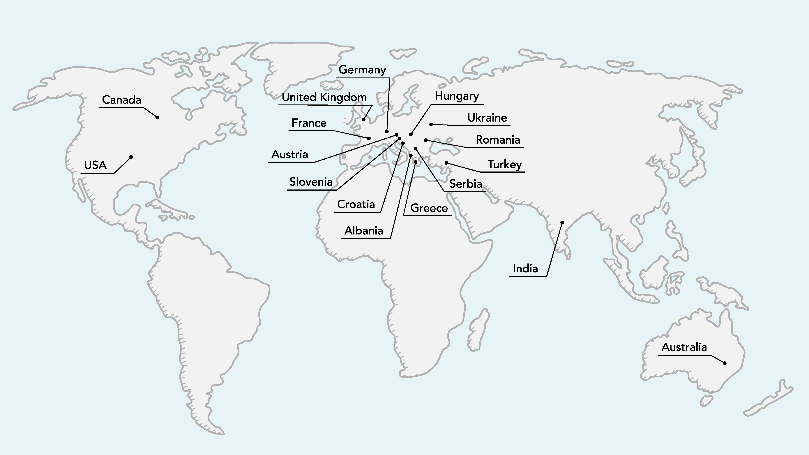
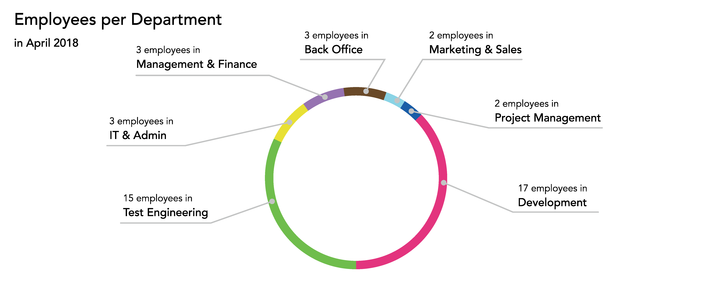
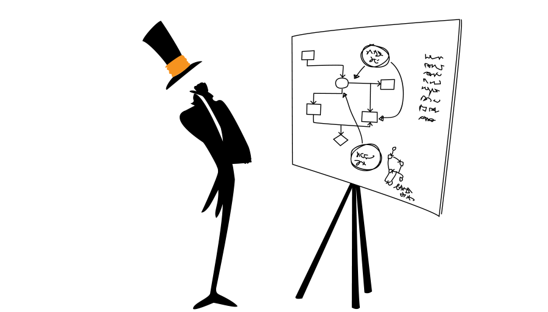

# The People of QiTASC 
Who is behind the software at QiTASC? Our team is made up of about 50 people between our Vienna and Düsseldorf locations. Despite being a small Austrian company, our employees come from nearly 20 different countries and have diverse technical backgrounds. This allows us to match the right specialists to our own projects *and* to support our customers.

## Where We Come From 

About half of our employees come from Austria or Germany, with another 40% coming from other European countries and the rest coming from North America, Asia and Australia. Many of our foreign employees came to QiTASC during or after completing a university degree in Austria. With so many different nationalities, English and German are the most commonly used languages in our offices. At our Vienna location, beginner and intermediate German courses are offered to employees who want to improve their fluency.

## What QiTASC Does 

QiTASC is largely made up of developers and test engineers along with several small 2-3 person teams in areas including IT, management and marketing. It's not uncommon to see developers working with the test team to get feedback on new features, or to see the technical writers liaising between testers and development to create documentation that is both technically accurate and helpful. Working across and within departments ensures knowledge transfer and lets us learn from each other.  

## Our Diverse Disciplines 

Although many of our employees previously studied computer sciences, IT or software engineering, some of the other backgrounds QiTASC's employees come from include:
* Chemistry
* Economics
* Engineering (e.g. electronic, electrical and bioresource)
* Finance
* Literature
* Math
* Music
* Physics
* Telecommunications

Having such a diverse group of people allows us to work in cross-disciplinary teams to tackle unique development and customer-specific problems that benefit from being looked at through multiple perspectives.

## Case Study: Audio Plugin 

A big challenge in automated mobile testing is executing tests that verify **voice announcements** are played in certain scenarios -- and that the *correct* announcements are played. Often, announcements must still be manually played back and checked, which can add a lot of unnecessary  additional time to testing. The QiTASC [Audio Plugin](http://www.qitasc.com/articles/20180326-AudioPlugin) was developed as a solution to this problem: Its **Audio Fingerprinting** functionality compares audio recordings against a database of reference announcements and provides a *similarity score*.

Developing the Audio Plugin could not have been possible without a multidisciplinary approach that drew on physics, computer sciences and sound engineering. One developer, with a background in theoretical physics, used his expertise to adapt existing audio comparison algorithms to our specific use cases. At the same time, a second developer who is currently studying media informatics used his knowledge of audio technology and sound synthesis to refine the Audio Plugin's features. A third developer, whose experience is firmly rooted in computer engineering, focused on developing all INTACT-side aspects of the Audio Plugin and integrating its functionality into our software.

## Case Study: Home Automation 

During a recent project, a customer used INTACT to control a home automation app that tested devices such as alarm systems, smoke detectors and thermostats. Because the customer's app interacts with different devices, the customer's test environments needed to include certain physical events and moving objects that could behave in ways that accurately reflect a real-life scenario. Luckily, one of our senior developers, who studied both telecommunications engineering and software engineering, had a lot of experience with building devices and integrating them into specialized computer programs. This allowed him to create several prototypes.

After a few experiments and some expert advice about INTACT's Apptest from our test engineers, we designed custom hardware that successfully behaved as an intermediary between INTACT and the devices being used by the customer's home automation app. This enabled the efficient use of Apptest to test the customer's home automation product.

### Every Day Innovation 
The recent home automation project and our new audio plugin are some of the project-level examples of our interdisciplinary approaches to technical problems. However, during project days, hack days and regular company-wide workshops, QiTASC employees also have the opportunity to collaborate, get creative and experience cross-learning. A few other new and soon-to-be released features that resulted from these events include:
* QiTASC TYCHE, resource aware scheduler that schedules tests on bots.
* The online [QiTASC Resource Center](http://docs.qitasc.com) and the [QiTASC Newsroom](http://www.qitasc.com/Newsroom/)
* Interactive Webtest & Interactive Apptest
* Internal data analysis tools
* Researching ways to reduce or avoid the need to write test cases

## Conclusion 
At QiTASC, our talented team of developers and test engineers -- along with our technical writers, sales & marketing, IT, management and back office -- have a variety of backgrounds both in terms of academic and professional experience as well as their countries of origin. This diversity means when a complicated technical challenge arises, we can draw on multiple areas of expertise to design sound solutions while sharing new knowledge with each other.

Are you interested in joining the QiTASC team? Check out our [Jobs](http://www.qitasc.com/about/jobs) page for open positions at both our Vienna and Düsseldorf locations!
