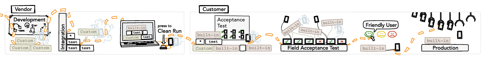

# Concise, Reusable Test Cases - How Compound Steps Can Simplify Your Test Design <a name="intro"></a>
Imagine that you are about to write a basic test case to test a call forwarding scenario. What kind of events must occur for `Phone A` to interact with `Phone B` and `Phone C`? How do you define these events? What happens if you need to change from simulated phones to real phones at different phases of your testing project?

**Compound steps**, which are parameterized steps that perform multiple actions in the background, are a great way to accomplish clean, readable test cases that can be used across all testing phases and even permit the use of **virtual phones** and simulated elements. These steps were designed on a high level that make the intent of the test case much clearer.


Before we get into compound steps, some examples and how they can be reused across projects, let's take a quick look at how front-end test design can look and its limitations.


## The Problem with "Simple Steps" <a name="simplesteps"></a>
If you're using a **keyword-based** testing tool, you might find yourself starting out with a test case that looks similar to this:

```
Feature: Voice call CFnA
  Scenario: CallForwardingNoAnswer
    Given an Android phone as B
      And an Android phone as A
      And an Android phone as C
    When B sends the following ussd "**61*" + C.number + "#"
      And within 10 seconds, B receives an ussd response as CFnAresp
      And deferred, B sends the following ussd "##61#"
      And deferred, within 10 seconds, B receives an ussd response as removeResp1
      And after 8 seconds, A dials the number B.number
      And within 25 seconds, B detects an incoming call from A.number
      And within 90 seconds, C detects an incoming call from A.number
      And after 4 seconds, C answers the incoming call
      And within 8 seconds, A connects
      And after 16 seconds, A ends the call and, within 15 seconds, he
      and C disconnect
```

In the example above, each line represents a single **step** in a test case. Each step accomplishes one single objective. We'll call these "simple steps." Test cases using simple steps involve a **procedural** or **sequential approach** that usually provides a step-by-step description of all the events and actions that will take place in the test. Unfortunately, this sequential approach to test case design has several limitations, including:
* The step currently being executed *blocks* all other steps. This means that `Phone B` could not receive a USSD at the same time as it detects the incoming call: Only one of these events can be processed at a time.
* Similarly, these steps don't allow for **parallel execution**, so if you added another set of steps to describe `Phone D`, `Phone E` and `Phone F`, you would have to wait for the first call flow to end before the next one would start.
* All events must be explicitly stated. Omitting a certain step (e.g. detecting the incoming call) could result in the test failing.
* The test case is cluttered and not reader-friendly.


## Compound Steps: A Cleaner Approach to Test Case Design <a name="compoundsteps"></a>
INTACT's compound steps were implemented to execute multiple **parameterized steps** in the background. These parameters may be explicitly specified: When they are not specified, INTACT uses default values. Unlike the procedural simple steps used above, compound steps are **declarative**. For example, a single voice call step *defines* a voice call, then *specifies* its characteristics. We use **step details**, which are indicated with asterisks (`*`) and nested beneath their steps, to provide these optional characteristics.

Using compound steps allows us to achieve the same results as our earlier scenario, but with a cleaner, focused scope. This means we could re-write our test case to look like this:

```
Feature: Voice call CFnA
  Scenario: CallForwardingNoAnswer

    # Prerequisites
    Given phones as A, B and C:
        * of type Android

    Given ensure settings on phone B:
        * with call forwarding no answer to C.number

    Given deferred, ensure settings on phone B:
        * without call forwarding

    # Execution
    And A starts a call to B as MYCALL:
        * call forwarding no answer to C within 75 seconds
        * ringing duration is 30 seconds
        * call duration is 120 seconds

    # Verification
    Then within 20 seconds, expect the call MYCALL to start ringing
    Then within 10 seconds, expect the call MYCALL to connect
    Then within 20 seconds, expect the call MYCALL to disconnect


```

By using compound steps, we have reduced the amount of steps needed to execute our call forwarding test from *13* to *4* steps! We also added additional steps at the end of the test to confirm events:
* The first compound step is for [phone assignment](https://docs.qitasc.com/intactsteps/compoundaddress/). It simply requires writing `Given phone(s) as <NAME>:`. A **step detail** was added here to specify the phone type `Android`. We could also specify details like phone, subscriber and network characteristics. In this case, INTACT provided default values to all the parameters we did not specify.
* The next compound step, the [ensure settings](https://docs.qitasc.com/intactsteps/compoundensure/) step, that we used specified that `call forwarding no answer` was configured. This `ensure` step allows for adding parameters like preferred network type, APN and other call forwarding types.
* We added a `deferred` modifier in front of the `ensure` compound step to remove call forwarding from `phone B`. This is a clean-up step used to ensure that call forwarding is not set on the phone when it is acquired in any subsequent test cases. If the test fails before this step, it will not be executed.
* Our third compound step is for the [voice call](https://docs.qitasc.com/intactsteps/compoundcall/) itself:
  * In the first example, we specified multiple parameters such as when `A` dials a number, when each phone detects the call and when `A` connects with C.
  * In our compound step example, however, the events that take place throughout the call flow are all implicitly defined by INTACT: This means we only need to specify additional parameters where necessary. Because this is a `call forwarding no answer` test, we chose a ringing duration of 30 seconds. If we had not specified it, the default value for this parameter is a random number between 2 and 6 seconds.
* In addition to the three compound steps we used, we also added some [expectation steps](https://docs.qitasc.com/intactsteps/expectcalldetail/). These steps are used to synchronize with the compound step that executes in the background so we can time appropriate actions like changing the tariff.


### What Else Do Compound Steps Do? <a name="whatelse"></a>
As we mentioned earlier, the simple steps used in our first example have several limitations including that they *block* other steps, prevent **parallel execution** and pose threats to test case stability because of the potential to leave out certain essential steps. Furthermore, as a test becomes more complicated, it often becomes more difficult to read even when using a user-friendly keyword-based framework. The high-level design of INTACT's compound steps promote readability, so users don't need to parse the **keyword soup** for its structure to know which scenario is being executed.

Compound steps provide solutions to all of the problems we described with simple steps. We designed our telephony compound steps to allow for parallel execution. This means while a compound step is being executed, other steps like checking subscriber details or booking tariffs can take place at the exact same time. The compound step's **step details** declaratively describe the call flow that will then be executed asynchronously in the background and do not block or interfere with other steps. If we had 30 phones available, we could even make 9 more copies of the steps above within our test case and all 10 voice calls would happen in parallel.

In our compound step example, we didn't mention *who* ended the call nor after *what amount of time* we expected a disconnect. Because of the **default parameters** provider by INTACT's compound steps, ending the call and disconnecting still happened. Since we only needed to specify the parameters that we needed to adjust, the test case contains a lot less text and is easier to read. Additionally, compound steps store their execution details in a reference with a unique identifier (e.g. phones `A`, `B` and `C` as well as the call `MYCALL`). These objects can later be accessed by INTACT in many ways depending on your specific needs.

Finally, **and most importantly**, compound steps were designed in a way that enables reusability in different test environments, including ones with simulated elements. We'll go into a bit more detail on this shortly.


### Parallel Execution - Downloading While Calling <a name="download"></a>

Now that we've demonstrated the difference between using compound steps and simple steps, we'll demonstrate what a more complex test case can look like that uses INTACT's compound steps. In the example below, we're going to make our calling party, `Phone A`, start a download and then make a call to `phone B` while the download is in process. As mentioned, compound steps *do not block*, which is why the download compound step can continue while the phone call compound step takes place.

This time we used our compound steps for phone assignment, phone settings, downloading data and making a voice call. We specified additional **step details**, or characteristics of the compound step, for parameters such as reconnects during downloads, which party ends the call and what type of phone is being used.


```
Feature: Compound steps with download and voice call

  Scenario: Compound steps with download and voice call

    # Prerequisites
    Given phones as A and B:
      * of type Android

    Given within 5 seconds, A disables wifi connection
    Given within 5 seconds, B disables wifi connection
    Given within 20 seconds, A enables data connections

    Given ensure settings on phone A:
      * registered in 4G

    # Execution
    And start recording a time sequence on phone A as timeSeqA

    And A starts a download from "http://testdata.qvie.qitasc.com/data/100MB" as MYDOWNLOAD:
      * it stops after 35 seconds
      * it allows 10 reconnects
      * it reconnects when detecting 20 seconds of inactivity

    And wait for 5 seconds

    And A starts a call to B as MYCALL:
      * detect incoming call within 10 seconds
      * ringing duration is 5 seconds
      * call duration is 12 seconds
      * callee ends the call

    # Verification
    Then within 20 seconds, expect the call MYCALL to start ringing
    Then within 10 seconds, expect the call MYCALL to connect
    Then within 20 seconds, expect the call MYCALL to disconnect
    Then within 60 seconds, A expects download MYDOWNLOAD to finish

    Then stop recording the time sequence timeSeqA
```

We also added some **simple steps** for data settings as well as a simple step that *records time and data sequences* so that we can visualize some of the test case's events it in a nifty chart. In our download graph, we can see the temporary drop in the download speed that coincides with `Phone A` making the call to `Phone B`:


This example test case involves a 4G download, but because of the voice call, the phone registers into the 3G network -- this is why we expect a drop in download speed. After the call ends, the phone  re-registers into the 4G network, which is why we expect another rise in download speed. INTACT offers additional steps to verify the drop and rise in download speeds, but that topic is beyond the scope of this article.

## Reusability: How Do Compound Steps Work Across All Testing Phases? <a name="reusability"></a>




Depending on the test phase, certain components such as phones or signals might need to be simulated for practical reasons. Consequently, different test cases often must be written to account for changes to the test infrastructure. Compound steps, however, have been implemented in such a way that the user can "switch" between using INTACT's **built-in steps**, which use real phones and **custom compound steps** that allow for using [virtual phones](https://docs.qitasc.com/intactbasics/stepdefs/) or external tools to simulate different event types. The test case-specific switching back is enabled by our [hierarchical configuration](https://docs.qitasc.com/configuration/hierarchicalconf/).

A standard example of reusing compound step-based test cases starts from the vendor developer's machine: At this stage, there could be an in-process simulation for dealing with phones and phone events. Here we would deactivate INTACT's built-in steps and activate the custom compound steps that enable virtual phone functionality. Meanwhile, in an integration environment, an INTACT user could use external simulators that actually generate SS7 traffic (e.g. CAP, INAP). These external tools are triggered via our [Executor Built-in](https://docs.qitasc.com/builtins/executor/) and used in tandem with the custom compound steps and virtual phones.

Next, in an acceptance environment, there could be a combination of both real phones and simulated phones. While real phones can be used in most scenarios, meaning the built-in compound steps would be activated, some network components might not yet be integrated. For these specific tests, we would switch back to the custom compound steps to make use of any required simulated or virtual elements, such as for generating data traffic. Finally, in field test or field acceptance environments, which *only* use real phones, the built-in compound steps would be activated for all tests. The same goes for the production environment, where we could also place a probing unit that continuously tests the production system.

By using these **compound steps**, we only need to write one test case and and *no further adjustments are necessary. The same test case can be concurrently executed on the developer's machine, the production system or in any phase in between*. On the backend, a few custom functions would still need to be written -- mainly for activating the virtual phones, which we talked about in the [Virtual Phones Tutorial](http://www.qitasc.com/articles/20180320-VirtualPhones).


## Conclusion <a name="conclusion"></a>
Compound steps provide a concise way to write and maintain test cases across all test phases. Unlike test designs using "simple steps," which are limited in their ability to execute more than one step at a time and don't always offer much flexibility in terms of back-end variability, **compound steps** enable parallel execution and offer a lot of options for customization. They're arguably much cleaner looking and also less prone to errors because of their parameterization, which include default values for conditions that don't need any tweaking. Additionally, compound steps have been designed in such a way that they can be ported across different test phases and environments: This means tests can be executed using virtual phones and other simulated inputs at certain phases, then switched to real hardware and inputs in live environments.

To date, we've created compound steps that cover a range of core network performance. This includes a great deal of telephony, SMS, data, speech channel monitoring and [audio recording and fingerprinting](http://www.qitasc.com/articles/20180326-AudioPlugin). Over the coming months, we'll be introducing compound steps to cover even more use cases and expanding their functionality.

*Are you interested in learning more about how to integrate compound steps into your testing?* Get in touch with us at office@qitasc.com to arrange for a demo!
