# Continuous Integration (Jenkins) With INTACT <a name="introduction"></a>
This tutorial will show you how to use the **Jenkins** continuous integration (CI) system to run INTACT test cases within a CI environment. A Jenkins Server manages **build projects**, which are executed on the Jenkins build agents.

This tutorial assumes that you know how to use **INTACT Client**. If you have not used INTACT Client before, please see our [INTACT Client tutorial](https://docs.qitasc.com/tutorials/IntactClient/clientintro/). This tutorial also assumes that you are familiar with the basics of **version control** (e.g. Git or Subversion).

## Required QiTASC Products
The following products must be installed and running using the QiTASC Cockpit in order to run INTACT test cases via Jenkins:

* INTACT Server - This should be running on a remote machine.
* ADM with Android SDK - This should be on the same machine on which the INTACT Server is running.
* INTACT Client - This must be the same version as for the INTACT Server.


For detailed installation instructions, please refer to the INTACT Manual's [INTACT Installation](https://docs.qitasc.com/installation/installation/) section.

## Infrastructure and Prerequisites
In addition to the above QiTASC products, the following must be set up and running:

* All **Jenkins build agents** must have INTACT Client installed: Test cases will be executed via INTACT Client on another remote machine where the INTACT Server is running.
* A Jenkins CI environment (a Jenkins server and optional Jenkins build agents)
  * If using a Jenkins Agent, INTACT Client must also be installed on the Agent (the same version as the INTACT server).
* An INTACT project that is under **version control**. If you do not have a project available, create the basic project that is described in the [INTACT Client tutorial](https://docs.qitasc.com/tutorials/IntactClient/clientintro/).

Admin access to Jenkins server is necessary to make the steps in the tutorial.

**Note**: There is always a Jenkins Server and there are always Jenkins Build Agents, however a Jenkins Server can also be used as a build agent.


## Configure and Start INTACT on the Remote Machine <a name="configureIntact"></a>

### Configuration
Add the following configuration block into the `Server.conf`, which is located in `QiTASC/intact-server/config`:


```go
Intact2ApiAdapter = {
        adapterPort: 36012
}

```

This means that the INTACT Server's API Adapter is configured to listen on port 36012.

### Start INTACT Server on the Remote Machine
It is important that the INTACT Server (with ADM) is running for the duration of the Jenkins usage. To start the INTACT Server from the command line, navigate to the `QiTASC` directory on your remote machine. Then enter the following commands:

**Windows Users**
```bash
qitasc start adm
qitasc start intact-server -a
```

**Linux and Mac OSX Users**
```bash
./qitasc start adm.exe
./qitasc start intact-server -a
```

The `-a` that follows `start intact-server` **must** be added for the phones to communicate properly with **adm**.

**Note**: It is a good practice to reserve an INTACT Server license exclusively for Jenkins usage. This is to avoid conflicts in case non-CI projects also need to be run.

## Configure and Run Jenkins <a name="configureJenkins"></a>
Now that you have set up your INTACT Client project, you can configure Jenkins so that it will run the INTACT project build.


## Add Environment Variables on the Jenkins Server <a name="envvariable"></a>
Next we'll configure three global environment variables so that INTACT and Jenkins can communicate with each other. Select `Manage Jenkins` from the left-hand menu, then select `Configure System`. You should see a view that looks like this:

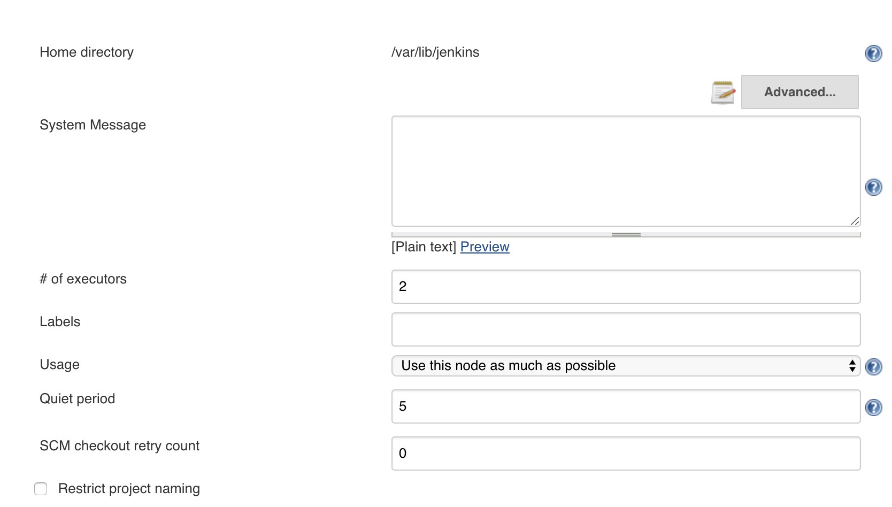

Scroll down until you reach a section called `Global properties`. This is where you will configure your **environment variables**.

Define an environment variable for each one of the following:

* `INTACT_SERVER` INTACT Server hostname.
* `INTACT_CLI_EXEC`: Location of the INTACT Client on the **agent**.
  * When there is more than one Jenkins agents, INTACT Client must be installed in the same location as *each* Jenkins agent.
* `INTACT_PORT` INTACT Server port, which should be `36012`, unless configured otherwise when [creating your project](../createproject.md).

**Example**
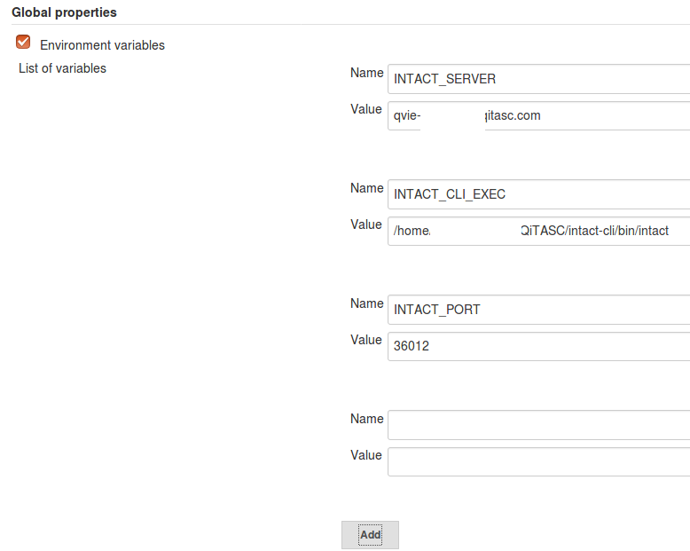


### Create a New Build Project <a name="createproject"></a>
Select `New Item` from the left-hand menu then click `Freestyle project`:

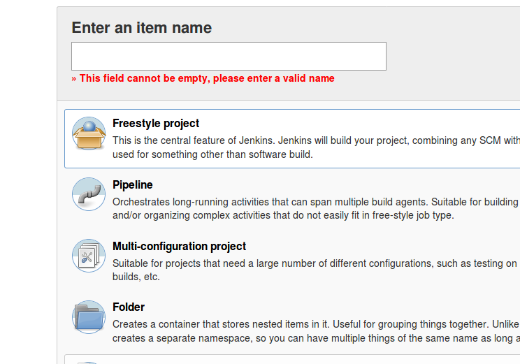

Assign the project a name of your choice, then scroll to the bottom of the page and click `OK`.

### Configure the Source Code Management <a name="configuresource"></a>
After assigning your project a name and clicking `OK`, the following view should appear:

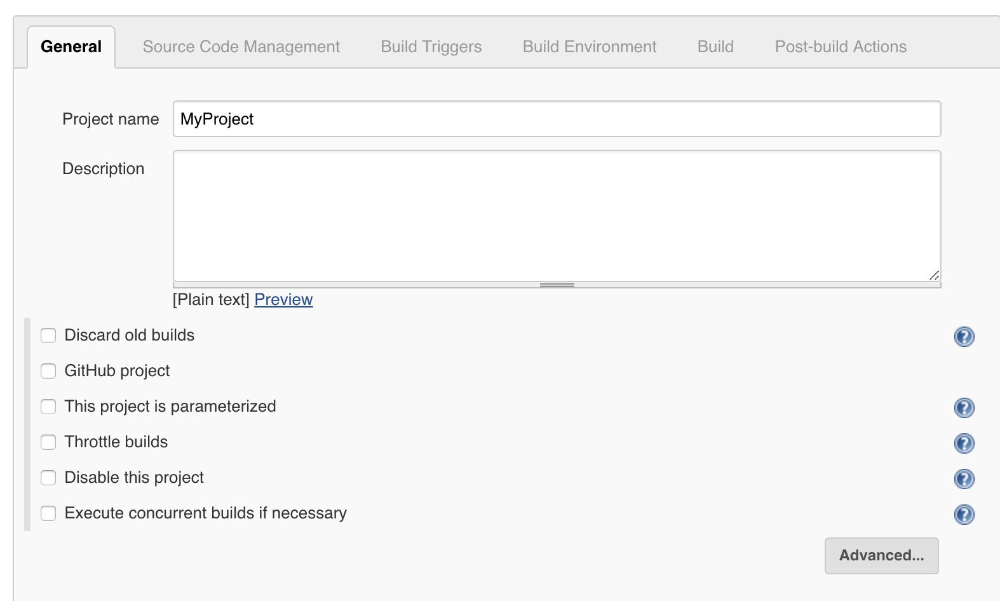

Select the `Source Code Management` tab. Here, you will need to configure the **version control tools** you are using for your project. If you are not sure what to put here, contact your administrator. Whether using **Git** or **Subversion**, select `jenkins` from the `Credentials` menu.

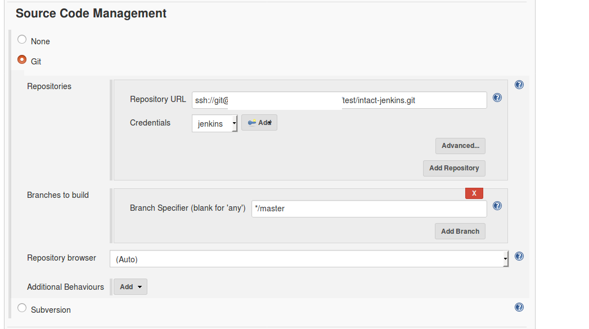

### Configure the Build Environment <a name="configureenvironment"></a>
Scroll down and click the `Delete workspace before build starts` box:


### Configure Build <a name="configurebuild"></a>
In the `Build` section, select the type of step you'll use to run the build. For this example, we'll use a Linux agent and choose `Execute shell`, then enter the following command into the text box:

```bash
$INTACT_CLI_EXEC test -h $INTACT_SERVER -p $INTACT_PORT HowTo-IntactClient
```

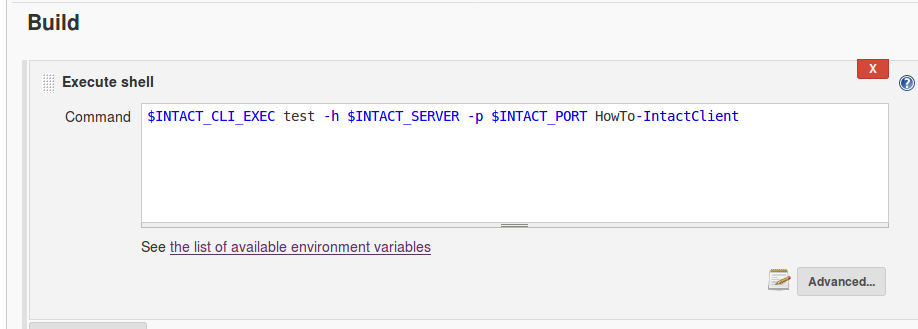

If you have already used our [INTACT Client Tutorial][INTACT Client tutorial] to execute features on a remote host, or used INTACT Client, then the syntax may look familiar to you. The only difference is that we are using environment variables to represent parameters:  
* The **host**, indicated by `-h`, which we configured with the **[environment variable](#envvariable)** `INTACT_SERVER` above.
* The **port**, indicated by `p`, which we configured with the **[environment variable](#envvariable)** `INTACT_PORT` above.
* Additionally, the folder where the INTACT feature files are is specified as `HowTo-IntactClient`.

When executing the same project via INTACT Client, the syntax would look like:

```bash
./intact test -h qvie-peter.qvie.qitasc.com -p 36012 HowTo-IntactClient
```

### Configure Post-build Actions <a name="configurepost"></a>
Finally, we'll add two **post-build actions**:
* Archive the artifacts
* Publish JUnit test result report

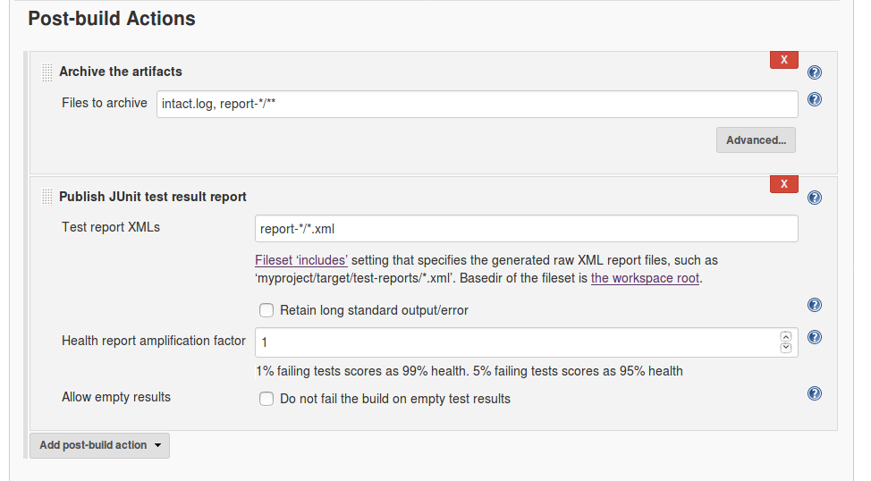

### Archive the Artifacts <a name="archive"></a>
First, we want to store INTACT Client's `intact.log` file for each run, as well as its report folder. Select `Archive the Artifacts` option from the `Post-build action` menu, and enter the following into the `Files to archive` field:

```
intact.log, report-*/**
```

### Publish JUnit Test Result Report  <a name="publish"></a>
Second, select `Publish JUnit test result report` from the `Add post-build action` menu and enter the following into the `Test reports XMLs` field:

```
report-*/**.xml
```

## Run the Jenkins Build <a name="run"></a>

Select `Build Now` from the drop-down menu containing your project's name. In our case, the project name is `MyProject`:


A status bar will appear -- This shows that your project is being executed:

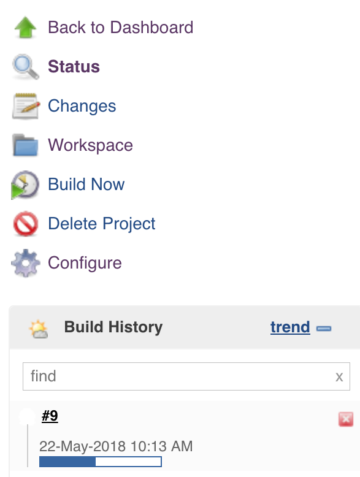

## Check Build Results <a name="checkresults"></a>

There are a few ways to check your projects' results. Clicking on the **build number**, e.g. `#9` in the example above, is a simple approach. Alternately, you can go to the **Jenkins Dashboard** and see a list of all projects:

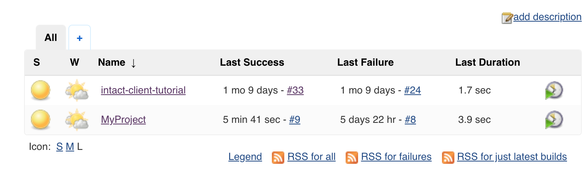

Clicking on a project brings up a summary/dashboard:


We'll select `Last successful build`, which brings up the following page:

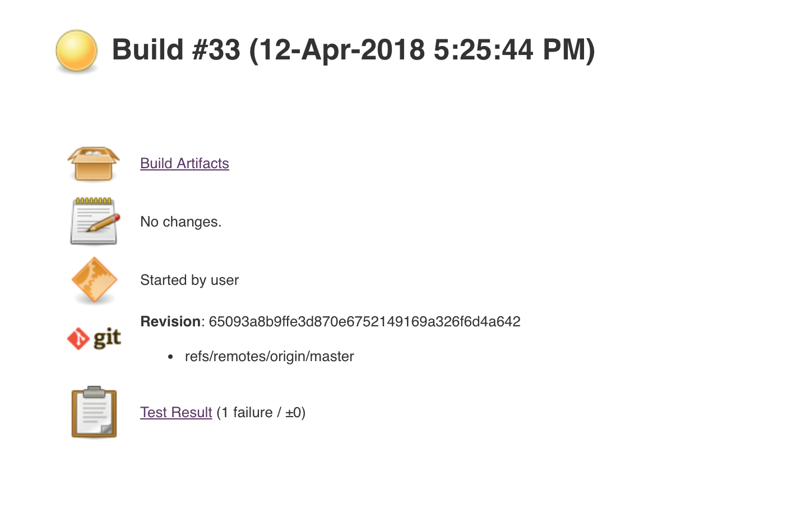

Clicking on `Test Result` gives a quick overview of what happened during the build:

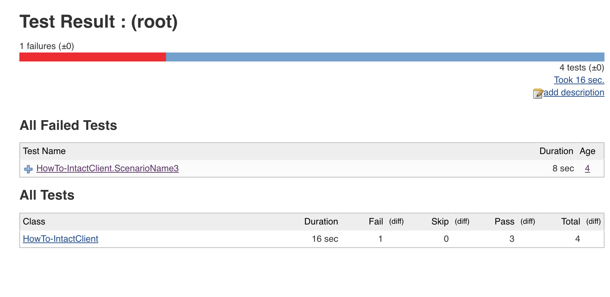

Alternately, we can go back to our project view and click on `Build Artifacts`, which provides a list of items created during the execution:


These artifacts are the same items that you would find in your projects' **reports** folder. If we click on the `report-20180412-172545` folder, we'll see the following list of artifacts:

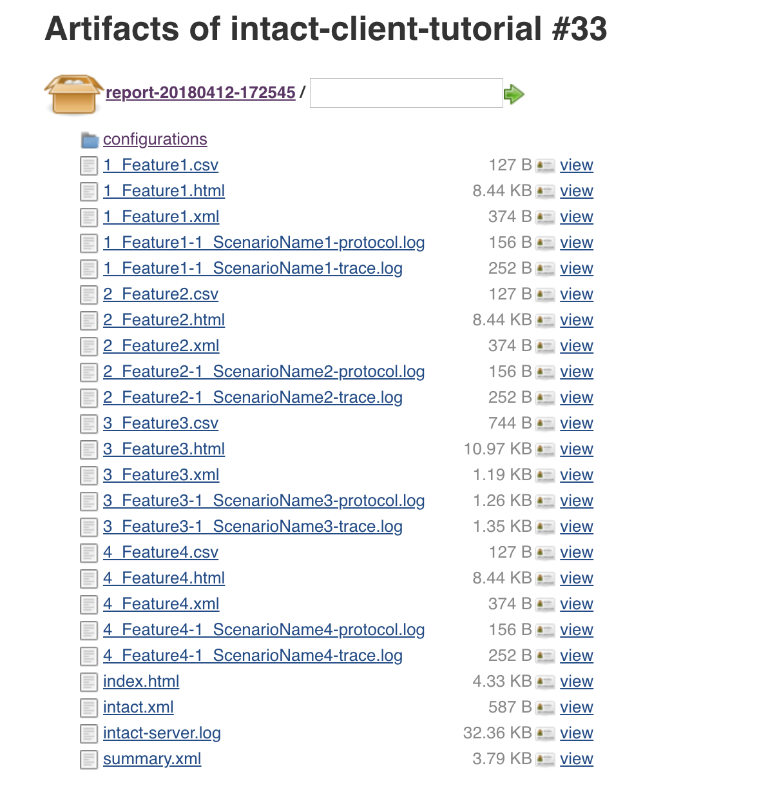
Click on the `index.html` report to see an overview of the results. For more information about the different report types that will appear as artifacts, refer to the INTACT Manual's [Reports and Logs](https://docs.qitasc.com/intactbasics/logsandreports/#indexhtmlreport) section.

## Conclusion <a name="conclusion"></a>

In this tutorial, we showed you how to integrate INTACT into a Jenkins **continuous integration** environment using the same test cases and project structure as for the [INTACT Client tutorial](https://docs.qitasc.com/tutorials/IntactClient/clientintro/). After demonstrating the basic project configurations, we provided a quick summary of the various ways you can examine the test results. The [Jenkins User Documentation](https://jenkins.io/doc/) is a great source of reference materials, including tutorials and use cases.

*Are you interested in learning more about how INTACT can be combined with tools like Jenkins and TeamCity?* Contact us at **office@qitasc.com** and we'll help you optimize your testing!
